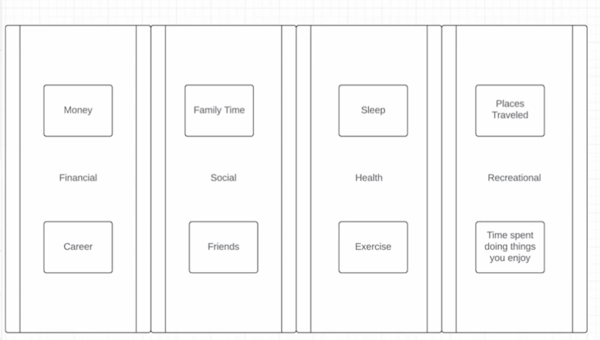
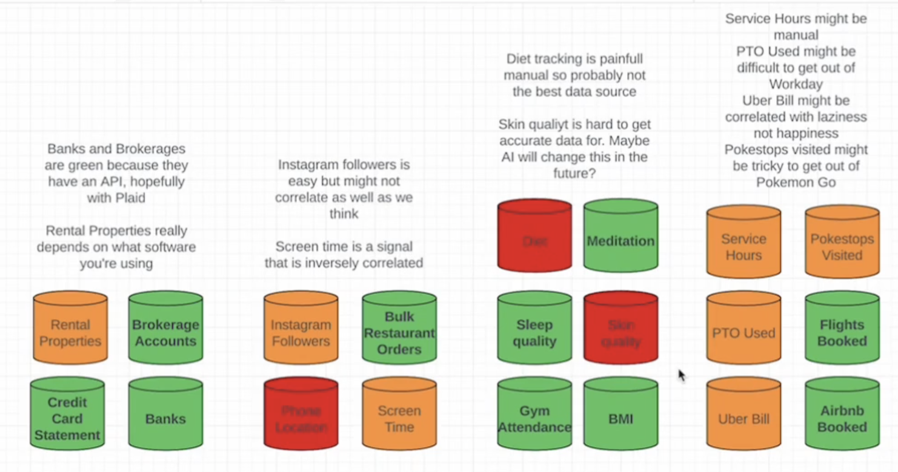
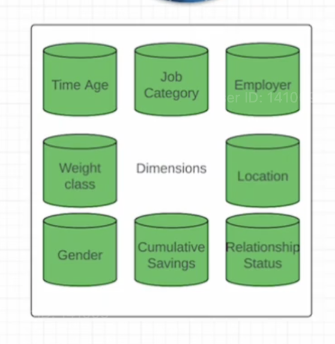

## Background 

Day1 lab, **Spec-Building**, is a demo on conceptual planning for data modeling. Here the project theme is how to measure your best life. The goal of this type of doc is to set the stage for realistic requirement establishment with stakeholders, document what can be done as well as future possibilities and on the human aspect demonstrate that all stakeholders are heard and their needs were seriously considered.

## Collected Info 

#### Metrics and their categories

### Needed data sources

Here the color coding of the data sources are indicative on how easy (green) vs more difficult (orange and red) the data will be to collect. Typically sources that can be fetched via a REST API are generally quite simple.

### Dimensions (how to break down metri calcs)

## Benefits of this step 

- it gives stakeholders an overview of what is needed vs want etc 

- its a good way to work with stakeholders in terms of how to prioritize the requirements based on cost/effor analysis: for the data that is very difficult to obtain (orange/red) how necessary it? etc

- helps drive the conversation from a hard no to instead perhaps for a future iteration 

- make stakeholders aware on the feasability and effort to help with convos in keeping vs excluding some requirements 

- can also be a blue print for the future iterations 

## Sources: Functional Data Engineering

* [medium](https://maximebeauchemin.medium.com/functional-data-engineering-a-modern-paradigm-for-batch-data-processing-2327ec32c42a) article 

* [YT](https://maximebeauchemin.medium.com/functional-data-engineering-a-modern-paradigm-for-batch-data-processing-2327ec32c42a) talk